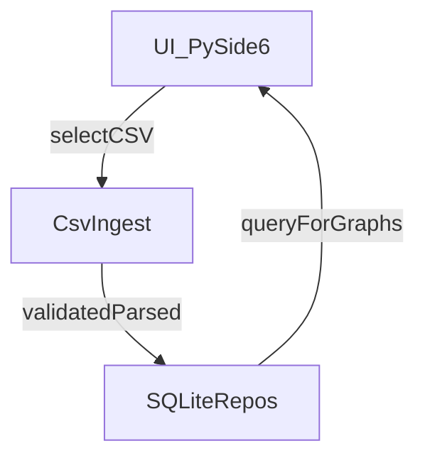

# План модернизации Avellon Tech

## Цели и ограничения

- **Цели**: покрыть проект тестами (юнит/интеграционные), добавить удобные скрипты запуска на macOS, структурировать код по пакетам, перейти от хранения данных в папках `projects/...` к хранению в **SQLite**.
- **Принято**: целевая БД — **SQLite**, и в БД храним **только распарсенные данные/метаданные** (не сохраняем исходный CSV как файл/bytes).
- **Текущая реальность кода**:
  - Точка входа: `Main.py` создаёт `QApplication`, `DbStorage`, `MainWindow`.
  - Доменные сущности (скважина/секции/шаги/файлы) сейчас жёстко привязаны к файловой структуре и `info.txt` в `borehole_logic.py`.
  - `DbStorage` пока только создаёт таблицы, но **не участвует** в бизнес-логике (кроме прокидывания в UI).
  - CSV читается в `graph_widget.py` через `pandas.read_csv(...)` и далее строятся графики.

## Предлагаемая целевая архитектура (минимально болезненная миграция)

- Разделить проект на слои:
  - **domain**: модели/правила (проекты, скважины, секции, шаги, измерения).
  - **ingest**: импорт CSV, валидация имени/заголовка, преобразование в структурированные данные.
  - **storage**: репозитории SQLite и миграции схемы.
  - **ui**: PySide6 окна/виджеты, которые обращаются к domain/storage через интерфейсы.

### Поток данных (после миграции)

## Шаги реализации

### 1) Инвентаризация и минимальные гарантии запуска

- Уточнить фактические требования к формату CSV (заголовок 6 строк, обязательные поля из `config.py`).
- Зафиксировать стабильную точку входа для запуска на macOS (скрипт + проверка окружения).

### 2) Тестовая инфраструктура

- Добавить `pytest` как основной раннер.
- Разделить тесты:
  - **Юнит-тесты**: парсинг имени файла (`third_party.get_num_file_by_default`), валидация заголовка CSV (`XYDataFrame.header_init`-логика, вынесенная в ingest), вычисления max/min/relative.
  - **Интеграционные**: импорт одного/нескольких CSV в временную SQLite (через temporary file) и проверка, что данные извлекаются корректно для построения графиков.
- Ввести фикстуры тестовых CSV (минимальные валидные/невалидные варианты) без крупных данных.

### 3) Новая схема SQLite и слой хранения

- Спроектировать схему под текущую модель:
  - `projects`, `boreholes`, `sections`, `steps`, `measurements` (или `files` как измерение),
  - хранение распарсенного сигнала: либо таблица `samples` (строки: measurement_id, idx, y), либо компромисс: хранить массив `y` как JSON-текст (быстрее внедрить, но хуже для запросов). Для старта — **JSON-текст** (быстрее миграция), с возможностью позже нормализовать в `samples`.
  - метаданные из заголовка (time_base, sampling_rate, amplitude, data_points, units).
  - derived-значения (max_y, min_y, mean_y) отдельными колонками для ускорения.
- Слой `storage` реализовать как простые репозитории поверх `sqlite3` (без ORM на первом этапе), чтобы минимизировать риски и зависимости.

### 4) Импорт CSV вместо копирования файлов в структуру папок

- Заменить текущую механику в UI, где файлы копируются в `projects/<borehole>/<section>/<step>/...` (см. `main_window.py`, `StepWidget.save_all`, `FileWidget.copy_to`).
- Новый путь: при выборе файлов UI вызывает ingest, который:
  - валидирует имя `DEFAULT_<sensor>_<depth>mm_<measurement>.csv` и заголовок,
  - парсит `y` и метаданные,
  - сохраняет в SQLite.
- Для совместимости на переходный период:
  - оставить чтение существующих проектов из папок как **read-only импорт** (опционально) или миграционную команду.

### 5) Реструктурирование проекта по папкам

- Ввести пакетную структуру (пример):
  - `avellon/ui/...` (всё Qt)
  - `avellon/domain/...`
  - `avellon/ingest/...`
  - `avellon/storage/...`
  - `avellon/config.py` (или оставить `config.py`, но ограничить доступ из domain)
- Оставить `Main.py` как тонкий bootstrap, который собирает зависимости.

### 6) Скрипты для macOS

- Добавить скрипты:
  - `scripts/init_macos.sh`: создать venv, установить зависимости, подготовить каталоги (если ещё нужны временно).
  - `scripts/run_macos.sh`: активировать venv и запустить `python3 Main.py`.
  - (опционально) `scripts/run_macos.command` для двойного клика из Finder.
- Обновить `README.md` секцией «macOS».

### 7) Декомпозиция “легаси”

- Убрать смешение PySide6 и PyQt5 в одном процессе — сейчас в `graph_widget.py` импортируются `PyQt5` классы вместе с PySide6. План: либо полностью перейти на PySide6, либо изолировать matplotlib/pyqtgraph зависимости так, чтобы не тянуть PyQt5.
- Удалить `requirements.txt` зависимость `sqlite3` (stdlib) при ближайшей правке зависимостей.

## Риски и как их снижаем

- **Риск**: большие массивы `y` в SQLite как JSON могут раздувать БД.
  - **Митигируем**: хранить агрегаты в колонках, а полные `y` — опционально; позже мигрировать на таблицу `samples` или сжатие.
- **Риск**: сильная связность UI и файловой структуры.
  - **Митигируем**: вводим тонкий слой сервисов/репозиториев и меняем UI постепенно (сначала импорт в БД, потом чтение графиками из БД).

## Что именно будем трогать в коде (основные узлы)

- `[Main.py](/Users/anikitin/PycharmProjects/Avellon_tech-main_latest/Main.py)`: bootstrap зависимостей.
- `[main_window.py](/Users/anikitin/PycharmProjects/Avellon_tech-main_latest/main_window.py)`: точки выбора/добавления файлов; убрать копирование в `projects/...`.
- `[borehole_logic.py](/Users/anikitin/PycharmProjects/Avellon_tech-main_latest/borehole_logic.py)`: вынести доменную модель из файловой структуры; затем заменить чтение/запись `info.txt` на SQLite.
- `[graph_widget.py](/Users/anikitin/PycharmProjects/Avellon_tech-main_latest/graph_widget.py)`: выделить парсинг CSV в ingest и убрать UI-побочные эффекты из парсера (MessageBox внутри парсинга мешает тестам).
- `[db_storage.py](/Users/anikitin/PycharmProjects/Avellon_tech-main_latest/db_storage.py)`: расширить до репозиториев/миграций.

