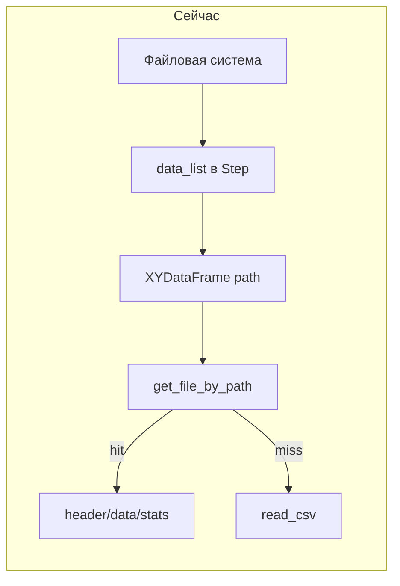
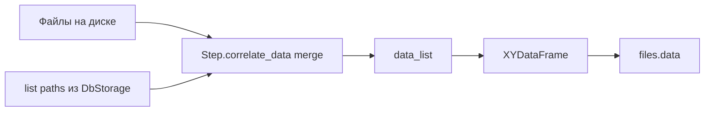

# План: результаты графиков в БД и данные из `files.data`

## Текущее состояние

- Таблицы [`frequency_characteristics`](db_storage.py) и [`wind_roses`](db_storage.py) в v1 уже задают модель **«скважина — файл — числовые идентификаторы»** (`borehole_id`, `file_id`, `frequency_characteristic_id` / `wind_rose_id`, `measurement_id`). Менять эту структуру **не нужно**: сами измерения по-прежнему лежат в [`files.data`](db_storage.py); по `file_id` (и пути в `files`) можно снова поднять [`XYDataFrame`](graph_widget.py) и пересобрать график.
- Сейчас эти таблицы **нигде не заполняются** прикладным кодом — только миграция из legacy.
- [`XYDataFrame`](graph_widget.py) уже отдаёт приоритет БД: [`_load_from_db()`](graph_widget.py) по `file_path`, иначе CSV и [`_save_to_db()`](graph_widget.py).
- Узкое место для «работать от data из файла»: [`Step.correlate_data`](borehole_logic.py) и [`DataFile.add_file`](borehole_logic.py) завязаны на **файлы на диске**. Если CSV удалён, но строка в `files` есть, файл в `data_list` не попадает.

## 1. Запись в `frequency_characteristics` и `wind_roses` **без изменения схемы**

**Идея:** при успешном построении графика сохранять не дублирующий JSON кривых, а **набор `file_id` исходных файлов** (плюс уже заложенные в таблицу числовые поля для дискриминации линий / измерений). Дальнейшее построение — через уже существующий поток «файл → `files.data` / диск → `XYDataFrame`».

- В [`DbStorage`](db_storage.py) добавить методы, работающие с **текущими** колонками, например:
  - `replace_frequency_characteristics_for_borehole(borehole_id, rows: list[tuple[file_id, frequency_characteristic_id]])` — в транзакции `DELETE FROM frequency_characteristics WHERE borehole_id = ?`, затем `INSERT` для каждой строки.
  - `replace_wind_roses_for_borehole(borehole_id, rows: list[tuple[file_id, wind_rose_id, measurement_id]])` — аналогично.

- **Откуда брать `file_id`:** нормализованный путь `DataFile.path()` → [`get_file_by_path`](db_storage.py) → поле `file_id`. Если записи ещё нет (редкий случай до кэша), можно один раз провнуть [`XYDataFrame(path)`](graph_widget.py), чтобы сработал `_save_to_db`, и повторить запрос.

- **Семантика числовых полей** (зафиксировать в комментарии к коду при реализации, без миграций):
  - **ЧХ:** `frequency_characteristic_id` — например номер датчика / индекс серии в контексте построения (как в текущей агрегации `get_sensor_21_dataframe_dict`), чтобы одна и та же скважина могла иметь несколько строк на один `file_id`, если это нужно модели данных.
  - **Роза ветров:** `measurement_id` — индекс измерения (согласованный с [`WindRoseGraphWindowWidget.replot_for_new_data`](main_window.py) / слайдером); `wind_rose_id` — вспомогательный ключ (например 0 или порядковый номер «снимка», если одна скважина хранит несколько вариантов — уточнить минимально достаточное значение при кодировании).

- **Точка вызова:** после того как `data_frames` собраны и график отрисован — в конце [`replot_for_new_data`](main_window.py) / после [`plot_graph_action`](main_window.py) для `FrequencyResponseGraphWindowWidget` и `WindRoseGraphWindowWidget`, с `borehole_window.borehole_id` и `main_window.db`. Ошибки БД — не ломать UI (как в [`XYDataFrame._save_to_db`](graph_widget.py)).

- **Восстановление графика «из БД»** (отдельный этап по желанию): чтение строк по `borehole_id`, загрузка соответствующих `files`, сборка структуры как при обычном открытии проекта — в этом плане достаточно заложить методы `get_frequency_characteristics_for_borehole` / `get_wind_roses_for_borehole`, если понадобятся сразу.

## 2. «Приложения от файла → от data из файла» (строка в `files`)

Без изменений по смыслу предыдущей версии плана:

- [`DbStorage`](db_storage.py): `list_file_paths_under_directory(dir_path)` (или выборка по `borehole_id` + фильтр путей).
- [`Step.correlate_data`](borehole_logic.py): объединить файлы с диска и пути из БД для каталога шага.
- [`DataFile.add_file`](borehole_logic.py) / [`DataFile.exist`](borehole_logic.py): учитывать наличие строки в БД по полному пути.
- [`__remove_file_by_index`](borehole_logic.py): не вызывать `os.remove`, если физического файла нет.

## 3. Риски и ограничения

- Нужна **однозначная** договорённость по значениям `frequency_characteristic_id`, `wind_rose_id`, `measurement_id`, иначе повторное построение по сохранённым строкам будет неоднозначным.
- Состав строк при каждом построении можно считать «последним снимком»: полная замена по `borehole_id` для соответствующей таблицы проще, чем инкрементальные правки.
- Пользователь просил не добавлять тесты и не запускать сборку — в объём работ не входит.

## Ключевые файлы

| Зона | Файл |
|------|------|
| SQL и запись связей | [db_storage.py](db_storage.py) |
| Синхронизация списка файлов | [borehole_logic.py](borehole_logic.py) |
| Сбор исходников при построении ЧХ/розы | [main_window.py](main_window.py), при необходимости [borehole_logic.py](borehole_logic.py) |
| Загрузка ряда из БД | [graph_widget.py](graph_widget.py) (`XYDataFrame`) |
